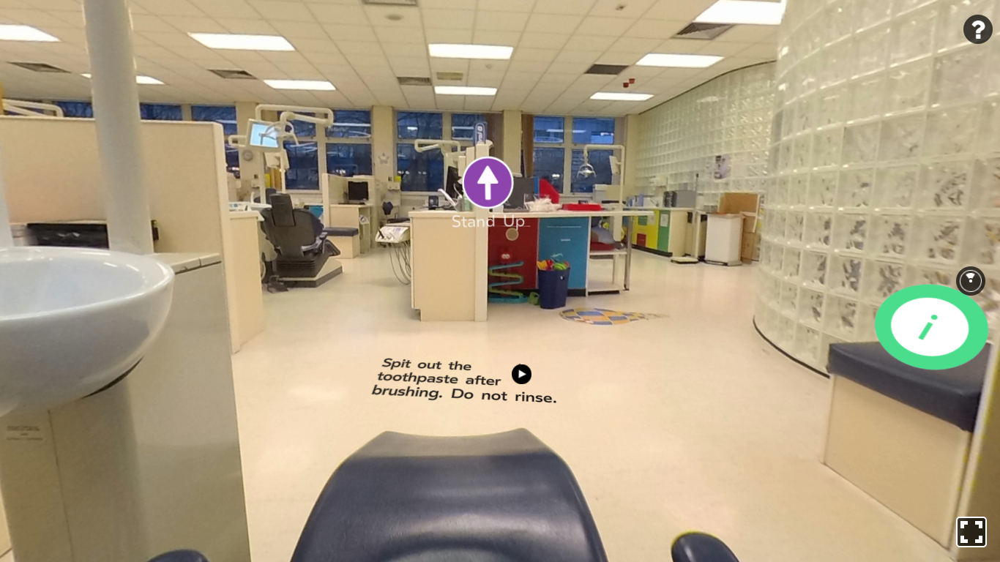

# Dentour Virtual Reality Tour


This application is a virtual reality tour of a dentist that is aimed at pre-teens/young adults between the ages of 12-16.

## Motivation

To create a safe immersive experience of virtual reality that enables phobia sufferers between the ages of 12-16 to accommodate themselves to frightening stimuli in preparation for similar experiences within a dental surgery.

## GitHub

https://github.com/GR31SS/Dentour

## GitLab

https://gitlab.cs.cf.ac.uk/c1602020/team11_vr_project

## Getting Started

These instructions will get you a copy of the project up and running on your local machine for development and testing purposes.

### Prerequisites

You will need to have Node.js and npm installed on your system
You can download them from the following link: https://www.npmjs.com/get-npm

### Installation

Installing node_modules
```
npm install
```
### Starting the application

Running localhost
```
npm start
```
You should then see the following message in the console:
```
open browser at http://localhost:8081/vr/
```

## Code style

[](https://standardjs.com)

## Built With

[ReactVR](https://facebook.github.io/react-360/)

[livetourlab](https://livetourlab.com)

## Screenshots

 <br/>
<p>Start Screen</p>
 <br/>
<p>Help DOM Overlay</p>
 <br/>
<p>Reception</p>
 <br/>
<p>Ground Floor Lifts</p>
 <br/>
<p>View from Chair in Paediatrics</p>
 <br/>
<p>Paediatrics side clinic</p>

## Features

As this tour has been designed for teenagers between the ages of 12-16, special features and considerations have been implemented/taken to enhance their experience;

- Interactive Quizzes

Throughout the tour, users are encouraged to participate in a 'true or false' quiz. All questions, answers and extra information has been taken from the [American Dental Association](https://www.mouthhealthy.org/en/Teens/fact-or-fiction). This will hopefully increase users excitement and prompt them to look around all rooms to gather more important information. 

- Bright and eye-catching colour schemes 

Using [ColorSafe Guidelines](http://colorsafe.co/), this project is accessible for as many as possible. Icon colours, information cards and prevention guidelines have all been designed based on WCAG Guidelines of text and background contrast ratios. This enabled us to create a beautiful tour with accessible colour palettes.

- Assisted Speech  

Increasing accessibility is such an important part of this project. Decreasing a child's fear is the main aim, any child/user should be able to reap the benefits of this tour. This is where assisted speech comes in. All prevention guidelines and user information messages have been recorded for users to listen to as well as read. As the project progresses more of the icons, room names and help instructions will be accessibly for visually impaired users. 


## Tests

To run the tests in a command prompt use
```
npm test a
```
This ensures that ALL tests written are run.

## Authors

**Allyson Kouao - 1609295**

**Bethan Williams - 1528956**

**Gareth Beddis - 1643718**

**Macaulay-Reiss Christian - 1602020**

## Acknowledgements

[livetourlab.com](https://livetourlab.com)

[Designed to Smile (prevention in Wales)](https://www.designedtosmile.org/welcome-croeso/welcome/)

[Delivering better oral health (England document with evidence)](https://assets.publishing.service.gov.uk/government/uploads/system/uploads/attachment_data/file/605266/Delivering_better_oral_health.pdf)

[SoundBible](http://soundbible.com) for the waiting room and elevator audio

[FlatIcon](https://www.flaticon.com/) for the navigation icons and general icons in the application

[FortniteTextGenerator](http://fortnitefontgenerator.com) for the start screen button

[MouthHealthy - American Dental Association (ADA)](https://www.mouthhealthy.org/en/Teens/fact-or-fiction) for the quiz questions and facts

[123R7](https://www.123rf.com/photo_14459764_panoramic-x-ray-image-of-teeth.html) for panoramic x-ray stock image

## Licencing

Oculus

## Wiki.md

Information on custom components and functionality can be found here.

