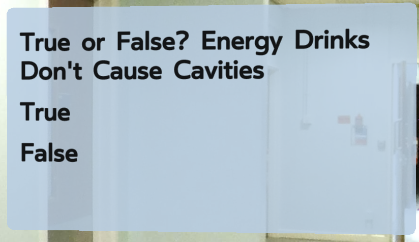
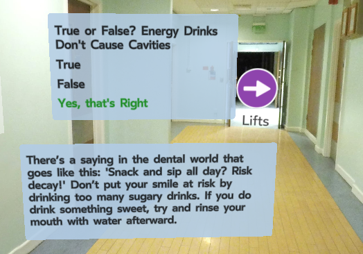

# Wiki

## LiveTourLab Overview
The LiveTourLab Library is an immersive library that can be used on the web and on mobile. This is a briliant base to any Virtual Reality project that is being created using the ReactVR and React360. LiveTour uses a simple json file that is used to specify the looks, overall design and structure of the tour.

LiveTour is full open-source and makes creating a Virtual Tour easy. It comes with really good and easy to read documentation with clear components for navigation, information cards, photos, videos and sound. Items can easily be modified and placed wherever on the page to help meet the users needs.

 LiveTour even offers uses to create there own custom components and has a tutorial that will help them setup the inital file. Developers are able to integrate their custom components into the simple json file.

## Custom Components
### Quiz
The purpose of the Quiz component was to offer further functionality and interactivity to the tour for the user. This component has been intergrated into the LiveTourLab Library and has the same JSON file structure as all the components in the library.

```javascript
"quiz": [
    {
        "question": "True or False? Energy Drinks Don't Cause Cavities",
        "true": "True",
        "false": "False",
        "correctAnswer": "False",
        "answerExplanation": "There’s a saying in the dental world that goes like this: 'Snack and sip all day? Risk decay!'",
        "correctOutput": "Yes, that's Right",
        "incorrectOutput": "No, that's Wrong",
        "rotateY": 225,
        "width": 1.4,
        "height": 0.78,
        "borderRadius": 0.02
    }
]
```

| Prop Name        | Default     | Description  |
| ---------------- |:-----------:| ------------:|
| `question`            |               | Question text (string value)   |
| `true`                |               | True Text (string value)           |
| `false`               |               | False Text (string value)                  |
| `correctAnswer`       |               | Correct Answer (string value)        |
| `answerExplanation`   |               | Answer Feedback (string value)   |
| `correctOutput`       | `"Correct"`   | Output Message if the answer is correct (string value)   |
| `incorrectOutput`     | `"Incorrect"` | Output Message if the answer is incorrect (string value)   |
|                       |               |    |
| `rotateX`             | `0`           | Position of quiz (degrees around X axis)   |
| `rotateY`             | `0`           | Position of quiz (degrees around Y axis)  |
| `translateZ`          | `-3`         | Z distance of quiz (VR units)   |
| `width`               | `1.1`        | Width of quiz (VR units)  |
| `height`              | `0.78`          | Height of quiz (VR units)   |
| `borderRadius`        | `0`           | Border radius of quiz container   |


#### This is how to create a question in the JSON

There is only one function in the quiz that handleClick and changes the state of the output and checks if the question is answered, which displays the feedback and the renders whatever message has been specified in the JSON file by user making the component that much more customisable to meet the developers and users needs. The message is then displayed depending on what answer is clicked and this is specified in the JSON file and this is what the handleClick function compares and determines the output that is rendered.

The quiz rendered using a View and uses VrButtons to make the options clickable. This triggers the handleClick function and changes the state answered to true and then outputs the message dependant on if it is true or false. There is feedback option that gives the user extra information from doing the quiz and this added in the JSON file.


#### This is how the question is rendered on the page


#### This is how to the question is rendered once answered with the feedback

### Environment Sound

Allows for background sounds to be played automatically within a scene, without the need for user action. 

An issue of using LiveTourLab's default sound component is that sounds are set to loop repeatedly. This component solves this by passing a loop option as a prop.

```javascript
    "environment-sound":[
        {"src":"sounds/file_name.mp3", "volume":1, "rotateY":160, "loop":true}
    ]
```

| Prop Name        | Default     | Description  |
| ---------------- |:-----------:| ------------:|
| `src`            | `null`      | Sound file source |
| `volume`         | `1`          | Controls sound volume where 0 is silent, 1 is 100%, 2 is 200% etc       |
| `rotateX`    | `0`          | Position of sound (degrees around X axis)|
| `rotateY`    | `0`          | Position of quiz (degrees around Y axis)   |
| `loop`    | `false`         |  Determine if sound plays once or repeatedly       |

### Button Sound

Displays an icon which contains a React VR Sound component. Allows for interactive sound elements, played when the user clicks the icon.

```javascript
"button-sound": [
    { "srcSound": "/sounds/sound_file.mp3", "volume": 2, "srcIcon": "/icons/sound_icon", "rotateX": 30 }
]
```

| Prop Name        | Default     | Description  |
| ---------------- |:-----------:| ------------:|
| `srcSound`            | `null`      | Sound file source |
| `volume`         | `1`          | Controls sound volume where 0 is silent, 1 is 100%, 2 is 200% etc       |
| `srcIcon`            | `null`      | Icon file source |
| `width`            | `0.1`      | Width of icon (VR units) |
| `height`            | `0.1`      | Height of icon (VR units) |
| `rotateX`    | `0`          | Position of icon (degrees around X axis)    |
| `rotateY`    | `0`          | Position of icon (degrees around Y axis)       |
| `translateZ`    | `-4`          | Z distance of icon (VR units) |


## DOM Overlay

The DOM Overlay has adapted from [Facebook's 360 Basic DOM Overlay Sample](https://github.com/facebook/react-360/tree/master/Examples/DomOverlaySample) and is used to implement a static help overlay. 

### Setting up the module in React VR:

Check the client.js file for the following steps:

1. Importing and creating the module instance.
2. Registering the module via nativeModules: [...] when creating VRInstance.
3. Creating the DOM element where the overlay will be rendered (div) and adding it to the DOM.
4. Initializing the DOM Overlay module.
5. Additionally, the process.js file is declared in the root project folder. This file is a hacky workaround for React not finding the process declaration in the context of React VR, which would in turn lead to an error during initialization.
   
### Help Overlay

Once the module has been setup, the functionality for the help overlay is split between several files found under the `./ui/` folder. 

`DomOverlayModule.js` handles the initial render of the overlay by calling the DOM element created in `client.js`. This module contains three methods which handle the help overlay's functionality:

- `renderHelpButton()` is called immediately upon render within `index.vr.js` to produce the static help button (`HelpButton.js`) in the top right corner of the screen (shown below).
 
  


- `openOverlay()` is used as an on click method on the help button and shows the contents of `HelpOverlay.js`.
  
- `closeOverlay()` unmounts the entire overlay container and then calls `renderHelpButton()` once again. This is a workaround method of closing the help overlay; code needs improvement as outlined within the file's comments.
